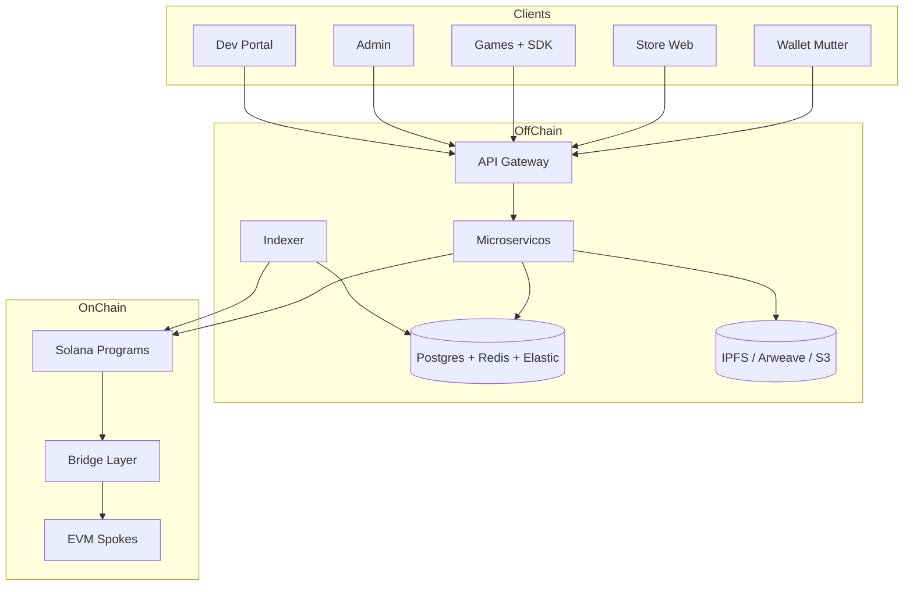
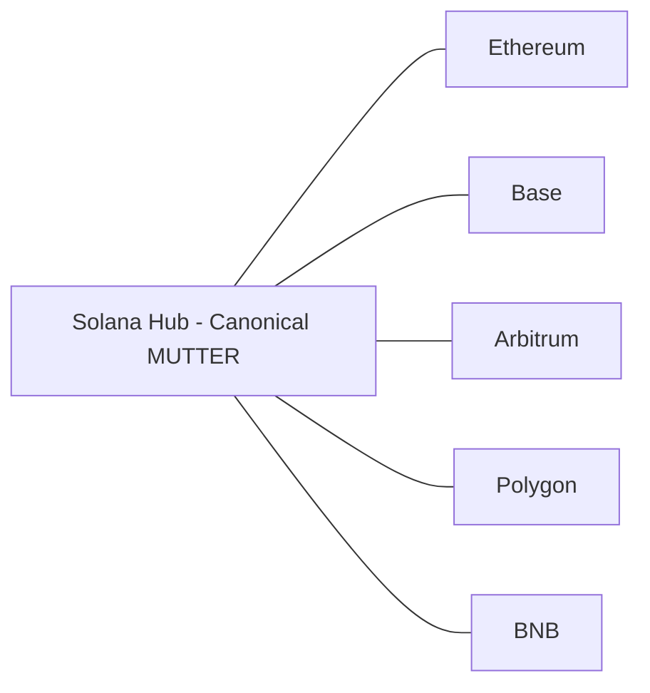

# Diagramas — Visão Geral

## Ecossistema ( Mermaid )

```mermaid
flowchart TB
  subgraph Clients
    W[Wallet Mutter]
    S[Store Web]
    G[Games + SDK]
    A[Admin]
    D[Dev Portal]
  end

  subgraph OffChain
    GW[API Gateway]
    SVC[Microservicos]
    IDX[Indexer]
    DB[(Postgres + Redis + Elastic)]
    IPFS[(IPFS / Arweave / S3)]
  end

  subgraph OnChain
    SOL[Solana Programs]
    BR[Bridge Layer]
    EVM[EVM Spokes]
  end

  W --> GW
  S --> GW
  G --> GW
  A --> GW
  D --> GW
  GW --> SVC
  SVC --> DB
  SVC --> IPFS
  SVC --> SOL
  IDX --> SOL
  IDX --> DB
  SOL --> BR --> EVM
```

## Hub-and-Spoke Chains

```mermaid
flowchart LR
  SOL[Solana Hub - Canonical MUTTER]
  SOL --- ETH[Ethereum]
  SOL --- BASE[Base]
  SOL --- ARB[Arbitrum]
  SOL --- POLY[Polygon]
  SOL --- BNB[BNB]
```
